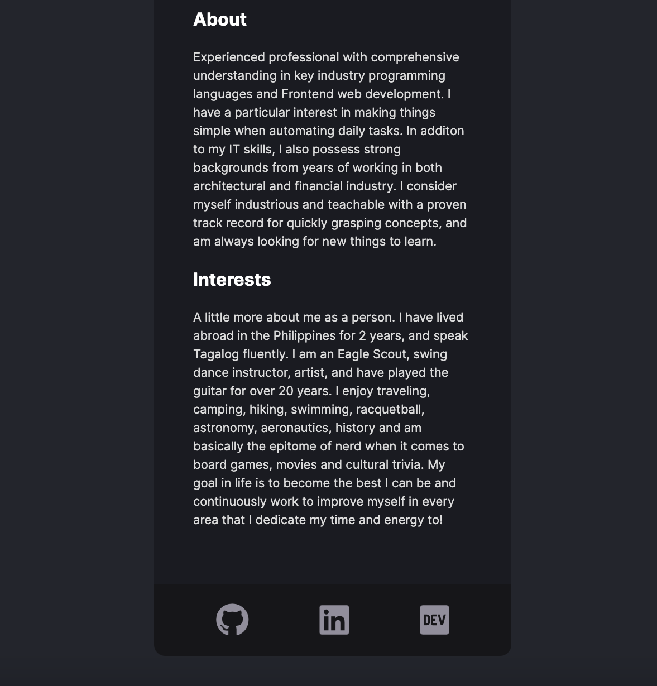

# Solo Project to create a basic Digital Business Card

#### A digital business card, complete with a basic layout, profile pic, hyperlinks to other sites I've created and added to, like my LinkedIn, Github, Portfolio page, and even my Blog page with DEV. This was all created with HTML/CSS, JavaScript, and React.

What I am most proud of is the fact that I was able to build the entire project from scratch, all within a few hours while in an environment that was not a normal programming desk. A few times, I was a bit stuck on how to do something, but my skills at searching on google for answers to my questions has definitely grown, to the point where I didn't get permanently stuck. Finding my own solutions, while also creating my desired layout and functionality is a LOT OF FUN!!!

### https://digbusinesscard.netlify.app/
